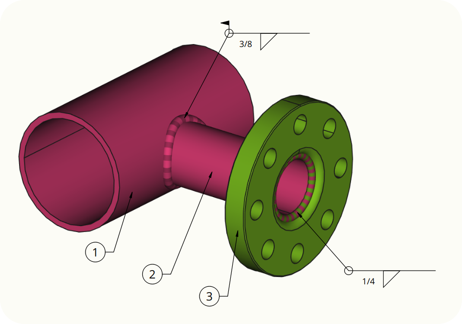

# FreeCAD WeldFeature

A FreeCAD module to add Visual representations of welds to assemblies:



## Installation

``` bash
cd ~/.local/share/FreeCAD/Mod/
git clone https://github.com/alexneufeld/FreeCAD_WeldfFeature.git
```

## Usage

This addon will add an additional toolbar with a single command to the **Assembly Workbench**. You will need a recent (> 0.21?) version of FreeCAD for this to work.

Select one or more edges or faces of an object in the 3D view, then activate the GUI command to add a weld bead along the selection(s). Use the Property manager to edit the properties of the weld bead.

**This software is in active development. Expect breaking changes**
